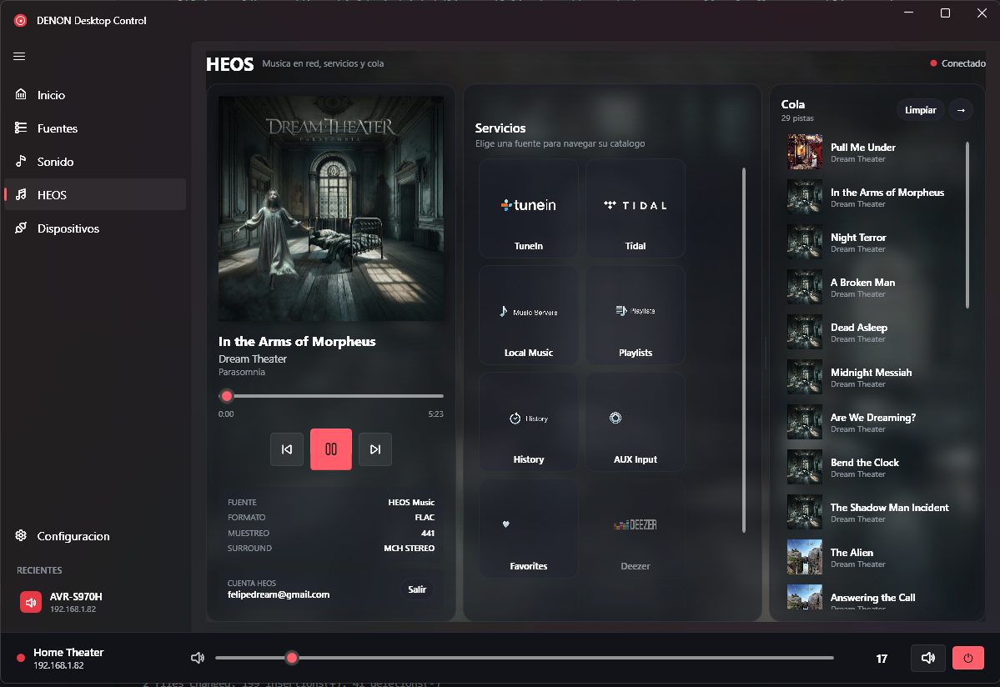

# DENON Desktop Control

<p align="center">
  
</p>

**Control remoto completo para receptores Denon y Marantz desde Windows.**  
Interfaz moderna Fluent/Mica, integracion HEOS con navegacion de Tidal y TuneIn, widget flotante en la bandeja del sistema, descubrimiento automatico de red, monitoreo en tiempo real, seek via UPnP y control completo de volumen, fuentes, canales, zonas y perfiles de sonido.

[](https://github.com/felipedream/denon-desktop-control/releases)
[](LICENSE)
[](https://www.paypal.com/donate/?business=felipedream@gmail.com&currency_code=USD)
[](https://t.me/felipedream)

---

## Caracteristicas

### HEOS — Musica en red

- 🎵 **Navegacion de servicios** — TuneIn (radios locales), Tidal, Local Music, Playlists, Favorites
- 🔍 **Busqueda** — por Artista, Album, Track y Playlist dentro de cada servicio
- ▶️ **Reproduccion directa** — click en un resultado para reproducirlo al instante
- 📋 **Cola de reproduccion** — caratulas, click para saltar, boton limpiar
- ⏩ **Seek funcional** — adelanta y retrocede arrastrando la barra de tiempo (via [UPnP AVTransport](https://en.wikipedia.org/wiki/Universal_Plug_and_Play))
- 🎨 **Fondo blur** — la caratula del album actual como fondo difuminado estilo Spotify
- 👤 **Login HEOS** — inicia sesion para habilitar Tidal, TuneIn, Deezer y favoritos
- 🖼️ **Tarjetas cuadradas** — servicios con logos grandes y navegacion intuitiva

### Control del receptor

- 🔍 **Auto-descubrimiento** — Encuentra tu AVR via [SSDP/UPnP](https://en.wikipedia.org/wiki/Simple_Service_Discovery_Protocol) + escaneo de subred
- 🎚️ **Volumen master** — Slider con debounce, botones +/-, unidad configurable (absoluto, dB, %)
- 🔊 **Nivel por canal** — Trim individual de FL, FR, C, SL, SR, SW (±12 dB)
- 💾 **Perfiles de sonido** — Guarda y recupera balances con un click (Normalizar, Guardar, Cargar)
- 📡 **Matriz de canales** — Visualizacion en tiempo real de senal de entrada y altavoces activos
- 🎛️ **Fuentes** — Cambio rapido con nombres reales del receptor (SHIEL, ROG GAME, nintendo...)
- 🎭 **Modos surround** — Stereo, Direct, Pure Direct, Multi Ch, Neural:X, Dolby y mas
- 🎵 **Tono** — Bass, Treble, Subwoofer con control fino
- 🏠 **Zonas** — Control independiente de Main y Zone 2 (Zone 2 nunca se enciende sola)

### Interfaz

- 📌 **Widget flotante** — Un click en el tray abre mini-control, doble click ventana completa
- 🌐 **Bilingue** — Espanol/Ingles automatico segun tu sistema
- 🔄 **Actualizaciones automaticas** — Chequea nuevas versiones al iniciar desde [haussmed.cl](https://haussmed.cl/denon/)
- ⚡ **Reconexion inteligente** — HTTP fallback cuando el AVR esta en standby
- 🔇 **Indicador de mute** — Icono y texto rojo cuando el receptor esta silenciado
- 🖥️ **Dark mode** — Interfaz Fluent/Mica con contraste alto

---

## Compatibilidad

| | |
|---|---|
| **Receptores** | Cualquier Denon o Marantz con puerto de red (AVR-X, AVR-S, Cinema, NR, SR series) |
| **Protocolos** | Telnet (23) · HTTP goform (8080/80) · [HEOS CLI](https://assets.denon.com/documentmaster/uk/heos_cli_protocolspecification.pdf) (1255) · [UPnP AVTransport](https://en.wikipedia.org/wiki/Universal_Plug_and_Play) (60006) |
| **Windows** | 10 / 11 (x64) |
| **Probado con** | Denon AVR-S970H |

---

## Instalacion

### Descarga directa

1. Ve a [**Releases**](https://github.com/felipedream/denon-desktop-control/releases)
2. Descarga `DenonDesktopControl-1.5.0-Setup.exe` (instalador) o `DenonDesktopControl-1.5.0.zip` (portable)
3. Ejecuta — no necesita .NET instalado (self-contained)

### Compilar desde fuente

```bash
git clone https://github.com/felipedream/denon-desktop-control.git
cd denon-desktop-control/src/DenonRemote
dotnet run
```

Requiere [.NET 8 SDK](https://dotnet.microsoft.com/download/dotnet/8.0).

---

## Uso

1. Al abrir, la app intenta conectar al ultimo receptor conocido
2. Si es la primera vez, ve a **Dispositivos** y pulsa **Buscar** o agrega la IP manualmente
3. **Click** en el icono de la bandeja = widget rapido
4. **Doble click** = ventana completa
5. En **HEOS**: elige un servicio, navega o busca, click para reproducir

---

## Stack tecnologico

| Componente | Tecnologia |
|---|---|
| Framework | [.NET 8](https://dotnet.microsoft.com/) + WPF |
| UI | [WPF-UI](https://github.com/lepoco/wpfui) 3.0.5 (Fluent/Mica) |
| MVVM | [CommunityToolkit.Mvvm](https://github.com/CommunityToolkit/dotnet) 8.4 |
| Tray | [H.NotifyIcon](https://github.com/HavenDV/H.NotifyIcon) |
| AVR Control | Telnet raw socket (eventos push en tiempo real) |
| AVR Fallback | HTTP goform API (power on desde standby) |
| HEOS | TCP CLI protocolo propietario Denon |
| Seek | UPnP SOAP (AVTransport:1) |
| Instalador | [Inno Setup](https://jrsoftware.org/isinfo.php) |

---

## Notas tecnicas

- **Seek**: el HEOS CLI no soporta seek (`Command not recognized`). Descubrimos que la app oficial usa UPnP AVTransport SOAP en el puerto 60006 — lo mismo que implementamos aqui.
- **Tidal "My Music"**: las carpetas personales devuelven la raiz en loop via CLI (bug del firmware S-series). La busqueda por nombre de playlist funciona como alternativa.
- **Fondo blur**: WPF no tiene `backdrop-filter` como CSS. Usamos `BlurEffect` sobre `ImageBrush` en un `Rectangle` con cards semi-transparentes encima.
- **Zone 2**: `PWON` enciende todas las zonas. Usamos `ZMON` + `Z2OFF` para encender solo Main.

---

## Capturas

<p align="center">
  
  
</p>

---

## Contribuir

Lee [CONTRIBUTING.md](CONTRIBUTING.md) para instrucciones de desarrollo y estructura del proyecto.

---

## Autor

**Felipe** · Buin, Santiago de Chile

| | |
|---|---|
| Telegram | [@felipedream](https://t.me/felipedream) |
| Email | felipedream@gmail.com |
| Donar | [](https://www.paypal.com/donate/?business=felipedream@gmail.com&currency_code=USD) |

---

## Licencia

[MIT](LICENSE) — Usalo, modificalo, distribuyelo libremente.
