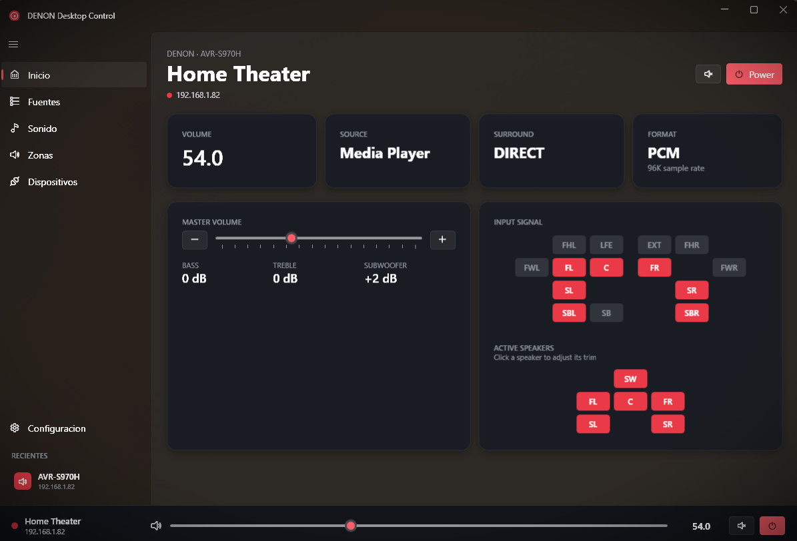

# DENON Desktop Control

<p align="center">
  
</p>

**Control remoto para receptores Denon y Marantz desde Windows.**  
Interfaz moderna Fluent/Mica, widget flotante en la bandeja del sistema, descubrimiento automático de red, monitoreo en tiempo real y control completo de volumen, fuentes, zonas y ecualización por altavoz.

---

## Características

- 🔍 **Auto-descubrimiento** — Encuentra tu AVR automáticamente vía SSDP/UPnP + escaneo de subred
- 🎚️ **Control de volumen** — Master, por zona, y trim individual por altavoz (±12 dB)
- 📡 **Input Signal / Active Speakers** — Visualización en tiempo real de la matriz de canales (como la pantalla del receptor)
- 🔊 **Fuentes** — Cambio rápido de entrada con un click
- 🎵 **Sonido** — Bass, Treble, Subwoofer, Tone Control
- 🏠 **Zonas** — Control independiente de Main y Zone 2
- 📌 **Widget flotante** — Un click en el tray abre un mini-control sin abrir la ventana completa
- 🌐 **Bilingüe** — Español/Inglés automático según tu sistema (configurable)
- 🔄 **Actualizaciones automáticas** — Chequea nuevas versiones al iniciar
- ⚡ **Reconexión inteligente** — HTTP fallback cuando el AVR está en standby, reconexión automática

## Compatibilidad

- **Receptores**: Cualquier Denon o Marantz con puerto de red (AVR-X, AVR-S, Cinema, NR, SR series)
- **Protocolo**: Telnet (puerto 23) + HTTP goform (puerto 8080/80) + HEOS CLI (puerto 1255)
- **Windows**: 10 / 11 (x64)
- **Probado con**: Denon AVR-S970H

## Instalación

### Descarga directa
1. Ve a [Releases](https://github.com/felipedream/denon-desktop-control/releases)
2. Descarga `DenonDesktopControl-1.0.0.zip`
3. Extrae donde quieras
4. Ejecuta `DenonDesktopControl.exe`

### Compilar desde fuente
```bash
git clone https://github.com/felipedream/denon-desktop-control.git
cd denon-desktop-control/src/DenonRemote
dotnet run
```

Requiere [.NET 8 SDK](https://dotnet.microsoft.com/download/dotnet/8.0).

## Uso

1. Al abrir, la app intenta conectar al último receptor conocido
2. Si es la primera vez, ve a **Dispositivos** y pulsa **Rescan** o agrega la IP manualmente
3. Click en el icono de la bandeja = **widget rápido**
4. Doble click = **ventana completa**

## Stack tecnológico

- .NET 8 + WPF
- [WPF-UI](https://github.com/lepoco/wpfui) 3.0.5 (Fluent/Mica)
- [CommunityToolkit.Mvvm](https://github.com/CommunityToolkit/dotnet) 8.4
- [H.NotifyIcon](https://github.com/HavenDV/H.NotifyIcon) (system tray)
- Telnet raw socket (eventos push en tiempo real)
- HTTP goform API (fallback + power on desde standby)

## Autor

**Felipe** · Buin, Santiago de Chile  
- Telegram: [@felipedream](https://t.me/felipedream)  
- Email: felipedream@gmail.com

### Donar

Si te gusta este proyecto, invítame un café:

[](https://www.paypal.com/donate/?business=felipedream@gmail.com&currency_code=USD)

## Licencia

[MIT](LICENSE) — Úsalo, modifícalo, distribúyelo libremente.
